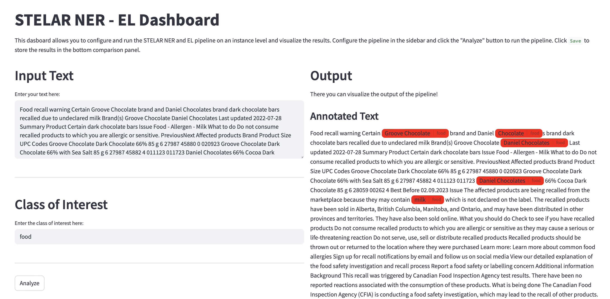
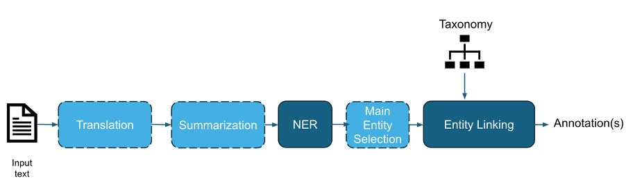

# Welcome

To the Named Entity Recognition and Linking pipeline UI.



## Functionality

This library performs a pipeline of translation, summarization, entity recognition (NER), main entity selection and entity linking (EL) on a given text.




### 1. Translation

Translation of text in English. Two methods available:
* deep-translator library
*  LLM*

  Note: If you want to run a Groq model, please enter your API key in scr/.env file and src/archive/.env file

### 2. Summarization

Summarization of given text. Method available:
* LLM

### 3. Named Entity Recognition (NER)

NER on given text for types specified by user. Available methods:
* InstaFoodRoBERTa (for food entities only)
* LLM

### 4. Main Entity Selection (MES)

Selection of single or multiple main entities that the text refers to. Available methods:
* LLM

### 5. Entity Linking

Linking of entities returned by NER module to k closest ontology entities. Ontology is given by the user. Available methods:
* ChromaDB
* bm25s
* LLM-augmented ChromaDB
* LLM-augmented bm25s
* LLM 

# Usage

### Installation

To install, clone the current repository. Navigate to GenericNER-main:

```
cd GenericNER-main
```

It is recommended to activate a new Python 3.12 virtual environment and activate it. 

```
python -m venv $VENV_PATH
source activate $VENV_PATH/bin/activate
```

To deactivate it:
```
deactivate
```

Install requirements:

```
pip install -r requirements.txt
```

Run dashboard:

```
streamlit run src/Dashboard.py
```

You're all set!

# Credits

Developed for EU-funded [STELAR project](https://stelar-project.eu/).
